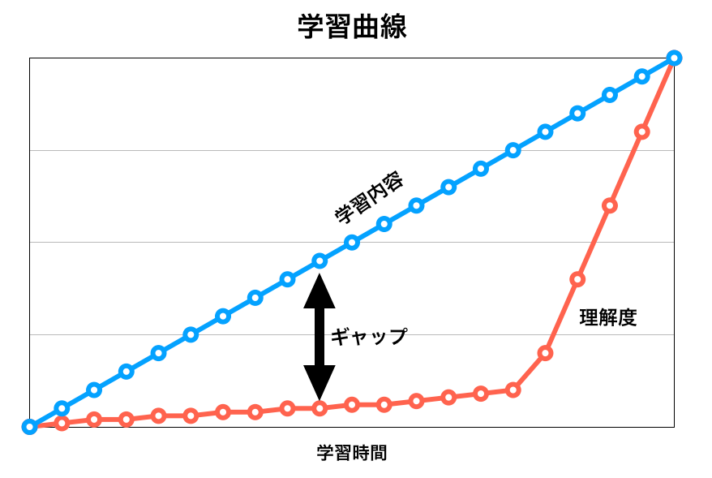

# 課題とその目的
Brainsではまずは、ちょっとした課題を入部の条件にしています。
安心してください。今までのメンバーも0からやってこれた簡単なものです。

ただ、姿勢は問われます。
こちらは学ぶ道筋や、工夫は教えられるのですが、
どうしても自己投資する姿勢や、モチベーションを維持できるかが問われますので、
希望者のそれを確認するためそのようにしています。
いうならば、加入希望者の方とBrainsという団体がマッチするかどうかの確認ですね。

**そして、以下3つを入部課題としています。**
- HTML/CSSとJavascriptの基礎
- 参考記事を読むこと
- プログラミングを通してしたいことの明文化

全部でざっくり20時間弱程度あれば終わると思います。
20時間集中してやると、思いの外できることが増え、視野も広がり、達成感を味わえると思います。

<!-- TOC -->

- [課題とその目的](#課題とその目的)
    - [期間](#期間)
    - [実際の内容](#実際の内容)
        - [0. まずはモチベーションをあげる。](#0-まずはモチベーションをあげる)
            - [プログラミングを始める人向け動画を見てみよう](#プログラミングを始める人向け動画を見てみよう)
        - [1. HTML/CSS/JavaScript](#1-htmlcssjavascript)
            - [やるうえでの意識](#やるうえでの意識)
        - [2. 参考記事を読む](#2-参考記事を読む)
            - [必要なヒューマンスキルについて](#必要なヒューマンスキルについて)
            - [モチベーション維持、挫折対策](#モチベーション維持挫折対策)
                - [学習曲線と忘却曲線](#学習曲線と忘却曲線)
            - [経産省が発表した資料（2017年5月）](#経産省が発表した資料2017年5月)
            - [Yahoo Japanが発表した資料（2017年2月）](#yahoo-japanが発表した資料2017年2月)
        - [1.2. をやったら、部員と話しましょう。連絡してください。](#12-をやったら部員と話しましょう連絡してください)
        - [3. 1)Will/Can 2)Brainsに自分が合うと思うところ、の明文化](#3-1willcan-2brainsに自分が合うと思うところの明文化)

<!-- /TOC -->

## 期間
やると決めた場合、長くても3週間でやってほしいです。
**自分でやり始める日付と締切を決めて、その期日を報告した上でやってください。**
開始してから、何らかの事情で締め切りを守れないと判断した場合、相談してください。
やる気がなくなった場合も、相談してください。
なお、その課題をやりながら、団体が開催する活動への参加は自由です。

## 実際の内容

### 0. まずはモチベーションをあげる。

#### プログラミングを始める人向け動画を見てみよう

[プログラミングの世界への導入動画](https://www.youtube.com/watch?v=nKIu9yen5nc "&quot;Code Stars&quot; - Short Film - YouTube")

必要なら日本語字幕を表示しましょう。
- 世界中にプログラミング教育を届けているCode.orgの動画
- Microsoft/Twitter/Facebook/Appleなどで活躍する人たちが、
  - プログラミングとの出会い
  - なぜプログラミングをするのか
- などを述べています。

> プログラミングをするためには、天才である必要はありません。でも、決心は必要です。

> プログラミングは人間性が大事で、どうやってテクノロジーで人助けをするかの話だっていうことを誰かがもっと早く教えてくれていたら、世界がもっと違って見えた気がします。

↑これは、Brainsにも合う考え方だと思います。動画内のメッセージの引用です。

### 1. HTML/CSS/JavaScript

<a href="https://www.nnn.ed.nico/packages/2/courses" target="_blank">N予備校の『【無料体験版】プログラミング入門』</a>をやってください。オンラインの講座です。
リンクをクリックして以下の画像に従って、必要に応じてアカウントを作ってください。ニコニコ動画のアカウントを持ってる人は、ログインを選べばOKです。

無事ログインできたら、<a href="https://www.nnn.ed.nico/courses/236/chapters" target="_blank">このリンク</a>から、講座を選び受講し、第0章と第1章を、以下の『やるうえでの意識』を読んでやってください。

#### やるうえでの意識
- やる言語は、主にWebpageを作るために必要なものになります。
- 上記講座をやりながら、以下を考えてください！
  - プログラミングとは何で、それで何ができて、できると何が良くて、
  - なぜそれが自分に必要か
- それら意識して、3.の課題（プログラミングを通してしたいことの明文化）につながるようにしてください。
- もし既にこのレベルを習得している場合、2.に移行してください。  
  - あるいは他の言語から学習したい場合、相談してください。

### 2. 参考記事を読む
以下の様なことを考えながら、**熟読する**。会った際に何を考えたか少し聞きますので。
- 自分がプログラミングで**何をしたいか（Will）**
- 自分が**持っている/いないスキルは何か(Can)**
- **どういう人材/課題解決が社会に求められているか(Must)**
- プログラミングに対する**モチベーションをどう維持するか**。

#### 必要なヒューマンスキルについて
会社の人事や、現場エンジニアに「一緒に働きたい人」を聞くと多くの場合、要は「プログラミングスキルとヒューマンスキルのある人」と答えられますので、Brainsは両者の獲得を目指します。
技術力だけでなく、以下のような**ヒューマンスキルに関心を持てる人は,Brains向いてる**と思います。
自分にはどういうスキルがあって、何がないのか、考えながら熟読してください。以下は一例です。
- <a href='http://type.jp/et/feature/2088' target='_blank'>Yahoo!ニュースの開発マネジャーはソフトスキルとどう向き合っているのか？エンジニアに必要な「コードを書く」以外のこと</a>
- <a href='http://hrnabi.com/2016/06/30/11349/' target='_blank'>プログラマーがコーディング能力より重視すべき4つの「ソフトスキル」</a>
- <a href='http://www.meti.go.jp/policy/kisoryoku/' target='_blank'>社会人基礎力（経済産業省）</a>
  - 経産省が『職場や地域社会で多様な人々と仕事をしていくために必要なら基礎的な力』を12の能力要素から成る『社会人基礎力』として定義付けている。

#### モチベーション維持、挫折対策

人間のモチベーションは、意図せずにある日一瞬で消えます。それに備えて、挫折対策や、モチベーションを維持する方法を知っときましょう。

- <a href='http://www.sejuku.net/blog/3286' target='_blank'>【完全保存版】プログラミング初心者が最初にやるべき10のコト</a>

- <a href='http://wayswebhack.com/programming-motivation-up/' target='_blank'>プログラミングのやる気が上がる記事まとめ</a>

- [オバマ元大統領が、”皆、未来のためにプログラミングしてくれ”と懇願する動画 ](https://www.youtube.com/watch?time_continue=77&amp;v=6XvmhE1J9PY "President Obama asks America to learn computer science - YouTube")  

##### 学習曲線と忘却曲線

モチベーション維持のために、学習曲線と忘却曲線について知っておきましょう。
学習に時間をかけたからといって、人はまっすぐに成長できるわけではありません。
往々にして、理解度は二次関数的に伸びます。

画像出典:http://blog.pyq.jp/entry/2017/12/14/090000

- [プログラミングの学習曲線](http://blog.pyq.jp/entry/2017/12/14/090000)について
- [ものごとの忘却曲線](http://free-academy.jp/junior/index.php?%E3%82%A8%E3%83%93%E3%83%B3%E3%82%B0%E3%83%8F%E3%82%A6%E3%82%B9%E3%81%AE%E5%BF%98%E5%8D%B4%E6%9B%B2%E7%B7%9A)について

つまり、地道にやり続ければやがて**覚醒**的なタイミング来るということです。画像で言うギャップに苦しまないようにしましょう！

#### 経産省が発表した資料（2017年5月）

- はやりの概念やマインドセット
- 全国的な課題に、政府がどう向き合おうとしているか

などを知るのに大変いい資料です。
作るアプリを考える上でも助けになります。なぜなら、国全体が進む方向に合わせたもの作れば、需要が見込めるからです。

- <a href='http://www.meti.go.jp/committee/summary/eic0009/pdf/020_02_00.pdf' target='_blank'>不安な個人、立ちすくむ国家。モデルなき時代をどう前向きに生き抜くか。</a>
  - <a href='https://www.businessinsider.jp/post-33716' target='_blank'>なぜ経産官僚は働き方に危機感を抱くのか キーパーソンが提唱する「AI格差時代の1億総学び社会」</a>
 
#### Yahoo Japanが発表した資料（2017年2月）

Yahoo Japanは"Update Japan"というビジョンを抱えていることもあり(2018-04-13時点)、ITにおける日本の課題感やゆくべき方向性を示した資料を公開しています。

[シン・ニホン](http://www.meti.go.jp/committee/sankoushin/shin_sangyoukouzou/pdf/013_06_00.pdf)

[↑上記資料を用いたプレゼン](https://www.youtube.com/watch?v=G6ypXVO_Fm0&vl=ja)

 #### Will Can Must について
 
 Brainsでは各自のWill Can Mustを重視します。
 **これはしっかり読んで下さい。**
 - <a href='http://terafeed.jp/20150513/will_can_must.html' target='_blank'>仕事とかキャリアでモヤモヤする時は「will・can・must」で整理するといいかもしれないというお話</a>
 - <a href='http://pras.wp-x.jp/?p=1005' target='_blank'>仕事とキャリアの悩みは「will・can・must」で整理しよう | IKIKATA [イキカタ]</a>
 
-------------------------

### 1.2. をやったら、部員と話しましょう。連絡してください。
気楽に話しつつ、マッチングの確認や、3.につながるような内容を話します。その際、
1. [2. 参考記事を読む](#2-参考記事を読む)際に考えることとして挙げたこと
2. Brainsの文化や向かおうとしている方向性

について話します。部内でやっているミーティングの形式を模します。

-------------------------

### 3. 1)Will/Can 2)Brainsに自分が合うと思うところ、の明文化
これまで課題/対話を踏まえ、２点を明文化してください。
皆様自身のモチベーション維持や挫折対策のために書いてください。暫定的で構いません。
資料として保存し、1年に数回振り返り、本人に加筆修正してもらいます。

1. WillとCan
    - Brainsでなにをしたいか、何を作りたいか（Will）
      - どういう価値を提供したいか、誰のどういう課題を解決したいか
    - Willの実現のために、どのようなスキルを身につけるべきと思うか（どんなCanを増やすか）
      - 自分に何ができるかわからないから、Willを答えられないという人は、、、
        - 最低限、何ができるようになりたいか、どのようなスキルをつけたいかを明文化してください
          - e.g.)アプリを作りたい、データ解析をしたい、便利なツールを作りたい
          - e.g.)課題発見力をを高めたい、発信力を高めたい
        - 世の中にあるサービスや課題を思い出して、それをどうしたら改善できるか考えてみるのも手です。

2. Brainsに自分が合うと思うところの明文化
    - 団体のVisionやMindを記述した、<a href="https://github.com/brains-tsukuba/Info-and-Rules/blob/master/README.md" target="_blank">README.md</a>を読んだり、部員との対話を思い出しながら、自分がBrainsと合うであろうこと、共感できることを記述してください。

以上2点について、それぞれ400字以内で記述してください。
